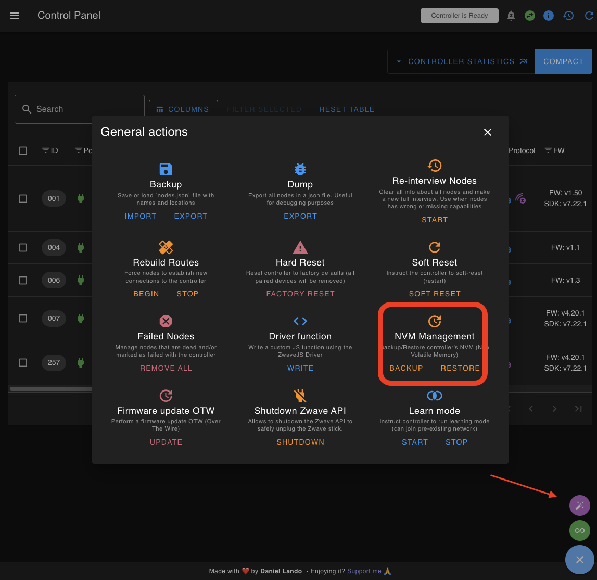

# Advanced: Migrating an Existing Z-Wave Network

Migrating your Z-Wave mesh to a TubesZB network controller lets you retire a USB stick without re-including every device. This guide focuses on migrations performed entirely inside **Z-Wave JS UI** while connecting to the TubesZB controller over TCP (`tcp://`).

!!! warning "Read this first"
    Migrations copy the controller's Non-Volatile Memory (NVM). If anything goes wrong you may lose access to your devices until the original controller is restored. 

## When to Use This Guide

Use these instructions when you already run Home Assistant with the **Z-Wave JS** or **Z-Wave JS UI** add-on (or a separate Z-Wave JS UI instance) and want to move the existing network to one of the following TubesZB controllers:

* Z-Wave PoE kit (single radio) – TCP port `6638`
* Dual radio PoE kit – Z-Wave available on TCP port `6639`

If you are starting from scratch, follow the standard [Z-Wave Getting Started guide](z-wave.md) instead.

## Prerequisites

Before you touch any hardware, confirm the following:

- **Z-Wave JS UI access**: You can open the web UI for the instance that manages your current Z-Wave network.
- **Security keys recorded**: Copy the existing `S2 Access Control`, `S2 Authenticated`, `S2 Unauthenticated`, and `S0 Legacy` keys from the current controller. Reusing the exact values is mandatory for secure devices to function after the migration.
- **Old controller firmware**: Update the firmware on the controller you are migrating *from* to the latest vendor release (SDK 7.19.x+ for 800-series radios is strongly recommended). Updated firmware fixes NVM compatibility bugs that can block migration.
- **Home Assistant 2023.9 or newer**: Required for the most recent `zwave_js` integration features referenced here.
- **TubesZB controller on your network**: The device is powered on, reachable over the LAN, and you know its IP address (or hostname). Assign a DHCP reservation so the address does not change mid-migration.

## Step 1 – Back Up the Existing Controller

1. Open **Z-Wave JS UI** for your current controller.
2. Go to **Settings → Z-Wave → Security Keys** and copy the four key values to a safe location (password manager or encrypted notes).
3. Scroll to the bottom of the page and select **Advanced Actions**.
4. Under **NVM Management**, click **Backup**.
5. Wait for the `.bin` (or `.nvm`) file to download. Verify the file size is larger than 100 kB; small files usually indicate a failed backup.

<figure markdown>
  { width="600" }
  <figcaption>Use the NVM Management panel in Z-Wave JS UI to create the backup you will restore onto the TubesZB controller.</figcaption>
</figure>

### Download the backup from Home Assistant

Backing up from the Home Assistant UI is useful when you do not have direct access to Z-Wave JS UI or want a second copy of the data.

**Why create a backup?**
:   It is recommended to create a backup before making major changes to your Z-Wave network, such as migrating between adapters or resetting hardware. The backup captures the adapter's Non-Volatile Memory (NVM), including your node and security information, in a binary file that you can download.

**Prerequisites**
:   Administrator rights in Home Assistant.

**To download the backup**
1. In Home Assistant, go to **Settings → Devices & services**.
2. Select the **Z-Wave** integration.
3. Choose the **cogwheel** icon to open the integration options.
4. Under **Backup and restore**, select **Download backup**.
5. Confirm the browser downloads the file on the device you are using to access Home Assistant.

!!! tip "Using the Z-Wave JS add-on (no UI)"
    If you still run the legacy **Z-Wave JS** add-on without the UI, install the **Z-Wave JS UI** add-on alongside it, stop the **Z-Wave JS** add-on, start the UI version, and point it to your existing USB stick. Once the UI sees your nodes, you can take the NVM backup from the UI and continue the migration.

    Alternatively, download the backup from within Home Assistant:

    1. In Home Assistant, go to **Settings → Devices & services**.
    2. Select the **Z-Wave** integration and choose the **cogwheel** icon.
    3. Under **Backup and restore**, select **Download backup**. The file saves to the device you are using.
    4. Stop the **Z-Wave JS** add-on and disable auto-start.
    5. Remove your old controller.

## Step 2 – Prepare the TubesZB Controller

1. Make sure the TubesZB hardware is powered and connected to your network.
2. In **Z-Wave JS UI**, stay on **Settings → Z-Wave** and populate the **Serial Port** field with the TCP path to the TubesZB kit. Examples:
   - Single radio kit: `tcp://192.168.1.42:6638`
   - Dual radio kit (Z-Wave side): `tcp://192.168.1.42:6639`
3. Paste the security keys you collected in Step 1 into the matching fields. Do **not** generate new keys when migrating an existing mesh.
4. Click **Save**. The service will restart and attempt to reach the new controller over TCP.

!!! danger "Only one controller at a time"
    After clicking **Save**, immediately unplug or power down the old USB controller. Running two controllers with the same Home ID at once can corrupt your mesh and create routing chaos.

## Step 3 – Restore the NVM Backup

1. In **Z-Wave JS UI**, open **Advanced Actions → NVM Management** again.
2. Choose **Restore** and upload the backup file you created in Step 1.
3. Wait for the progress dialog to reach 100%. Do not close the browser or refresh the page.
4. When prompted, allow Z-Wave JS UI to restart the controller.
5. After the restart completes, the controller should display the same Home ID as the old stick, and your devices will appear in the control panel.

!!! info "RF region and power"
    Double-check **Settings → Z-Wave → RF Region**. Z-Wave JS should auto select the correct region if not select the region that matches your regulatory requirements before you restore the NVM. Changing the region afterwards requires another restore.

## Step 4 – Verify Home Assistant and Rebuild Routes

1. Open **Settings → Devices & Services** in Home Assistant and ensure the existing `Z-Wave JS` integration shows as **Connected**. If it is unavailable, select **Configure** and confirm that the WebSocket URL still points to your Z-Wave JS UI instance (typically `ws://a0d7b954-zwavejsui:3000`).
2. In **Z-Wave JS UI**, review a few nodes to confirm their interview status is **Complete**.
3. Launch **Advanced Actions → Rebuild Routes**.
   - Enable **Include sleeping nodes** so battery-powered devices refresh their paths.
   - Enable **Delete priority return routes** to discard stale manual routes from the old controller.
4. Monitor the control panel for failed nodes. Wake sleeping devices manually if needed to finish the rebuild.
5. Once the rebuild finishes, verify automations and entities in Home Assistant behave as expected.

## Step 5 – Clean Up and Update Backups

- Archive the NVM backup you created in Step 1 along with a fresh backup taken from the TubesZB controller after the restore.
- Label the old USB stick and store it powered off. Do not plug it back in unless you intend to roll back to it.
- Update any documentation or diagrams that list the controller address so they reference the `tcp://` endpoint.

## Troubleshooting

**Controller refuses the TCP connection**
:   Confirm the TubesZB kit is running the latest ESPHome firmware and that your firewall allows outbound TCP 6638/6639 from Home Assistant.

**Nodes show as failed or missing after restore**
:   Wake battery devices, then run **Advanced Actions → Heal Node** on problematic nodes. If secure devices still fail, verify the security keys exactly match the originals (no extra whitespace).

**Home Assistant keeps rediscovering a second controller**
:   You may have left the old USB stick connected. Remove it, reboot Home Assistant, and clear ignored discovery notifications.

**Restoring the NVM fails immediately**
:   The old controller firmware may pre-date the TubesZB controller's stack version. Update the original controller to a newer SDK, re-connect it temporarily, create a fresh backup, and try again.

## Further Reading

- [Home Assistant: Migrating a Z-Wave network to a new adapter](https://www.home-assistant.io/integrations/zwave_js/#migrating-a-z-wave-network-to-a-new-adapter)
- [Nabu Casa: Migrating an existing Z-Wave network to Home Assistant Connect ZWA-2](https://support.nabucasa.com/hc/en-us/articles/29529265751965)
- [Z-Wave JS UI Documentation](https://zwave-js.github.io/zwave-js-ui/)
