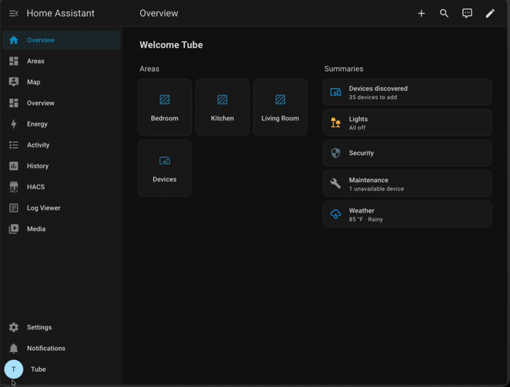

# Updating to the Z-Wave Proxy Firmware

Firmware **2026.07.11.0** moves all TubesZB devices with a Z-Wave radio from the raw TCP serial stream to the native **ESPHome Z-Wave Proxy**. A recent zwave-js change ([zwave-js#8861](https://github.com/zwave-js/zwave-js/pull/8861)) breaks reconnection over serial-over-TCP streams; the proxy is the supported path going forward.

!!! danger "Breaking change — action required"
    After installing this firmware update, the Z-Wave TCP serial port is **removed** (`6638` on Z-Wave-only kits, `6639` on Dual Radio kits). Z-Wave JS will **not reconnect** until you update its connection settings as described below. Plan for a few minutes of Z-Wave downtime.

**Affected devices:**

* Z-Wave PoE Kit (`tubeszb-zw`, `tubeszb-2026-zw`)
* Dual Radio Kits (`tubeszb-dual-radio-kit-cc2652`, `tubeszb-dual-radio-kit-mgm24`, `tubeszb-dual-radio-mgm21-2022`)

!!! note "Zigbee is unaffected"
    On Dual Radio kits, the Zigbee serial stream (port `6638`) is unchanged. No Zigbee2MQTT or ZHA changes are needed.

## Before You Update

* **Your Z-Wave network is safe.** The network (nodes, security, routing) is stored on the Z-Wave radio module itself; this firmware update does not touch it.
* **Take a backup anyway (recommended).** In Home Assistant go to **Settings → Devices & Services → Z-Wave**, and under **Backup and restore** select **Download backup**. It's free insurance.
* **Note your device's IP address.** You'll need it for the new connection path. A DHCP reservation is strongly recommended if you don't have one already.
* **Update Z-Wave JS UI / the Z-Wave JS add-on to the latest version** so it supports `esphome://` connections.

## Step 1 – Install the Firmware Update

1. In Home Assistant, open the TubesZB device page under **Settings → Devices & Services → ESPHome**.
2. Find the **TubesZB Firmware Update** entity and select **Install**.
3. Wait for the device to flash and reboot (about a minute). The Z-Wave JS connection will drop — this is expected.

!!! tip "Alternative: web installer"
    You can also update from the device's built-in web page (`http://<device-ip>`) using the firmware update entity there, or flash the latest release binary from the [Latest Release folder](https://tube0013.github.io/TubesZB-ESPHome-Builder/Latest_Release/).

## Step 2 – Point Z-Wave JS at the Proxy

The connection path changes from `tcp://<device-ip>:6638` (or `:6639`) to:

```
esphome://<device-ip>:6053
```

Follow the section that matches your setup.

### Home Assistant Z-Wave Integration

1. Go to **Settings → Devices & Services → Z-Wave**.
2. Select **Migrate adapter** (under the integration's configuration).
3. In the **Migrate or reconfigure** dialog, choose **Reconfigure the current adapter** — you are keeping the same radio, only changing how it's reached.
4. Select **Use Socket**, and replace the old `tcp://` path in the **Socket device path** field with the new one, e.g. `esphome://192.168.1.7:6053`.
5. Submit and wait for the driver to restart.

<figure markdown>
  { width="600" }
  <figcaption>The full flow: Migrate adapter → Reconfigure the current adapter → Use Socket → esphome:// path.</figcaption>
</figure>

### Z-Wave JS UI (Standalone / Docker)

1. Open **Settings → Z-Wave** in the Z-Wave JS UI web interface.
2. In the **Serial Port** field, replace the old `tcp://` path with `esphome://<device-ip>:6053`.
3. Leave your **Security Keys** exactly as they are.
4. Click **Save**. The service restarts and connects through the proxy.

## Step 3 – Verify

* The Z-Wave integration / control panel shows the controller as **Connected**, with the **same Home ID** as before.
* Your nodes appear with their interview status intact — no re-inclusion is needed.
* On the device's web page, the old "Z-Wave Serial Connection Status" sensor is gone; the device now reports firmware `2026.07.11.0` under **TubesZB ESPHome FW Version**.

## Troubleshooting

**Z-Wave JS says the connection failed after updating its settings**
:   Confirm the device actually took the firmware update — check that **TubesZB ESPHome FW Version** on the device page (or web UI) reads `2026.07.11.0` or newer. On older firmware, keep using the `tcp://` path until you update.

**`esphome://` is not accepted in the path field**
:   Your Z-Wave JS UI / add-on version predates ESPHome proxy support. Update the add-on / container to the latest version and try again.

**Connected but no traffic / driver won't start**
:   The proxy allows **one** client at a time. Make sure no second Z-Wave JS instance (an old add-on still running, a test container) is connected to the same device, then restart the driver.

**I need to roll back**
:   Previous release binaries remain available on the [GitHub releases page](https://github.com/tube0013/TubesZB-ESPHome-Builder/releases). Flash the prior version via the device web page and restore your old `tcp://` settings.
