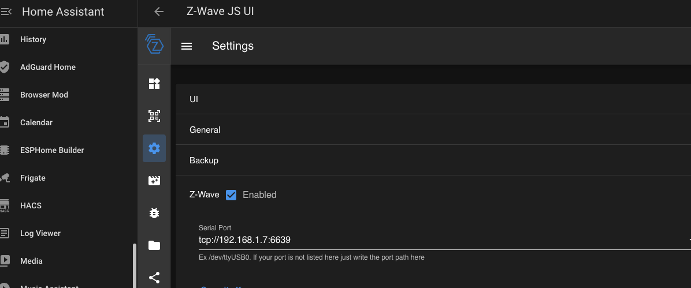
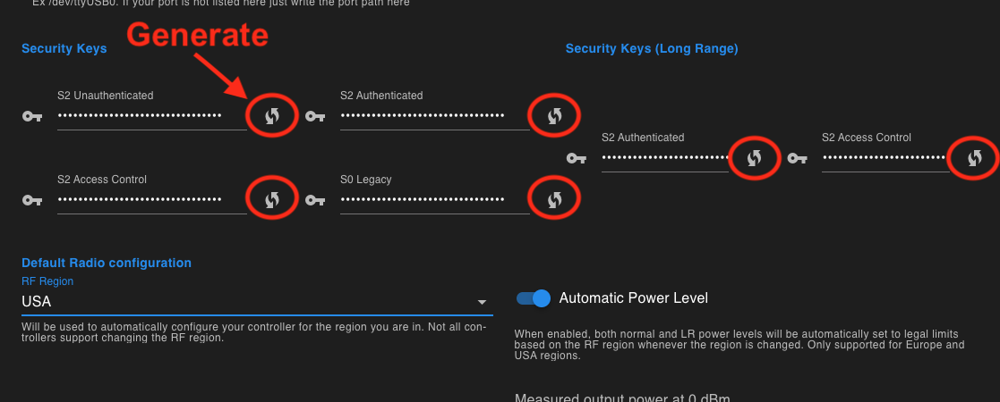
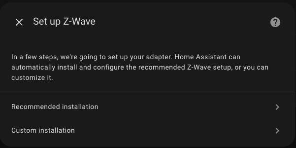
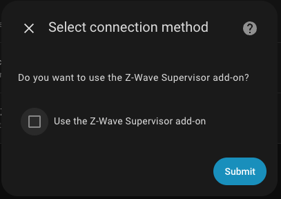
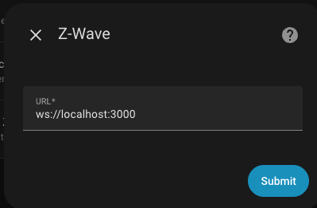

# Getting Started with the Z-Wave PoE Kit

This guide will walk you through setting up your new TubeZB Z-Wave PoE Kit with Home Assistant.

!!! info "Choose the right path"
    - Setting up your first Z-Wave network? Continue with this guide.
    - Migrating from another controller? Follow the [Advanced: Migrating an Existing Z-Wave Network](z-wave-migration.md) guide instead.

## 1. Physical Setup

Your setup steps will depend on whether you purchased the kit with the Zooz Z-Wave module pre-installed or the "No Radio" version.

### Option A: Kit with Pre-installed Zooz ZAC93

If you purchased the kit with the Zooz ZAC93 module included, it comes pre-installed and ready to go.

1.  Connect the Z-Wave PoE Kit to your local network using an ethernet cable that provides Power over Ethernet (PoE).
2.  The device will power on and connect to your network.
3.  Find the IP Address assigned to the device from your router's client list.

!!! tip "Use a DHCP Reservation (Recommended)"
    To ensure the device's IP address doesn't change, it is strongly advised to configure a **DHCP Reservation** for it in your router's settings. This links the device's unique MAC address to a specific IP, so it gets the same one every time it connects.

    !!! info "Advanced: Static IP Firmware"
        Setting a true static IP requires custom firmware. For advanced users who need this, you can build a custom firmware binary using the **[TubesZB ESPHome Firmware Builder](https://github.com/tube0013/TubesZB-ESPHome-Builder)**.

!!! success "Register Your Zooz Module!"
    If you purchased a kit including the Zooz ZAC93, be sure to **[register your module with Zooz](https://www.getzooz.com/register/)** within 30 days of purchase. This gives you a 5-Year Extended Warranty, direct access to firmware updates, and expedited support.

### Option B: Kit with No Radio (Bring Your Own Module)

If you purchased the "No Radio" version of the kit, you will need to provide and install your own compatible Z-Wave module.

#### Compatible Modules

This kit is designed for Z-Wave modules that use the Raspberry Pi GPIO pin layout.

* **[Zooz 800 Long Range ZAC93](https://amzn.to/3O2ewpM)**
* **[Z-Wave.me RaZberry 7 Pro](https://amzn.to/41XOFVK)**

!!! info "Affiliate Link Disclosure"
    The links above are Amazon affiliate links. As an Amazon Associate, I earn from qualifying purchases.

#### Installation

1.  Carefully open the 3D printed enclosure.
2.  Align the GPIO pins on your Z-Wave module with the female GPIO header on the Olimex ESP32-PoE board.
3.  Press down firmly and evenly to seat the module securely. Ensure all pins are correctly engaged.
4.  Close the enclosure.
5.  Follow the steps in **Option A** to connect the device to your network and find its IP address.

---

## 2. Home Assistant Setup

The recommended method for using this Z-Wave kit is with the **Z-Wave JS UI** addon in Home Assistant.

1.  **Install and Start the Addon:**
    * Click the badge below to open the Z-Wave JS UI addon page in your Home Assistant instance and click **Install**.

    [](https://my.home-assistant.io/redirect/supervisor_addon/?addon=a0d7b954_zwavejs2mqtt&repository_url=https%3A%2F%2Fgithub.com%2Fhassio-addons%2Frepository)

    * Once installed, go to the **Info** tab and **Start** the addon.

2.  **Configure the Addon via the Web UI:**
    * After the addon has started, click **Open Web UI**.
    * In the Z-Wave JS UI interface, navigate to **Settings** (the gear icon) and then select **Z-Wave**.
    * In the **Serial Port** field, enter the network path for your Z-Wave kit, replacing `IP_ADDRESS` with the IP you found earlier:
      ```
      tcp://IP_ADDRESS:6638
      ```
    <figure markdown>
      { width="600" }
      <figcaption>Entering the TCP address in the Serial Port field.</figcaption>
    </figure>

        !!! info "Important Note for Dual Radio Kits"
            If setting up Z-Wave on a **Dual Radio kit** it uses port `6639`.

    * **Generate and Save Security Keys:**
        !!! danger "Critical Step for New Networks"
            If you are setting up a **new** network, you **must** generate new security keys. These keys are essential for securely including devices and for backing up your network.

         1.  Scroll down to the **Security Keys** section.
         2.  Click the refresh icon next to **each** of the four keys (`S2_AccessControl`, `S2_Authenticated`, `S2_Unauthenticated`, and `S0_Legacy`) to generate new random values.
         3.  **Copy and save these keys somewhere safe**, like a password manager. You will need them if you ever have to restore your network.

    <figure markdown>
      { width="600" }
      <figcaption>Generating new security keys by clicking the refresh icon for each key.</figcaption>
    </figure>

    * Click **Save** at the bottom of the page. The addon will restart and connect to your Z-Wave PoE Kit. You can check the **Control Panel** to see your Z-Wave stick appear as the controller.

3.  **Install the Z-Wave JS Integration:**
    * Navigate back to Home Assistant and go to **Settings > Devices & Services**.
    * Home Assistant should now auto-discover the Z-Wave JS integration. Click **Configure** and follow the prompts.
    * If it is not discovered, click **Add Integration** and search for **Z-Wave**.
    * You will be prompted to either use the recommended installation or a custom one. Since we are using the Z-Wave JS UI addon, you can proceed with the **Recommended installation**.
    <figure markdown>
      { width="400" }
      <figcaption>Choose the recommended installation.</figcaption>
    </figure>
    * In the next dialog, **uncheck** the box that says "Use the Z-Wave Supervisor add-on" and click **Submit**.
    <figure markdown>
      { width="400" }
      <figcaption>Uncheck the box to provide the URL manually.</figcaption>
    </figure>
    * You will now be asked for a URL. For the official Home Assistant addon, you can find the correct hostname on the addon's page.
    <figure markdown>
      { width="600" }
      <figcaption>The addon hostname can be found on the Addon Info page.</figcaption>
    </figure>
    * Enter the following value, which tells the integration how to connect to your Z-Wave JS UI addon:
      ```
      ws://a0d7b954-zwavejsui:3000
      ```
    <figure markdown>
      { width="400" }
      <figcaption>Enter the addon's WebSocket URL.</figcaption>
    </figure>
    !!! tip "Connecting to a Remote Z-Wave JS UI"
        If you are running Z-Wave JS UI on a different computer (not as a Home Assistant addon), you must replace `a0d7b954-zwavejsui` with the hostname or IP address of that computer. For example: `ws://192.168.1.100:3000`.
    * Click **Submit** to complete the setup. The integration will connect, and your Z-Wave devices will appear in Home Assistant.
